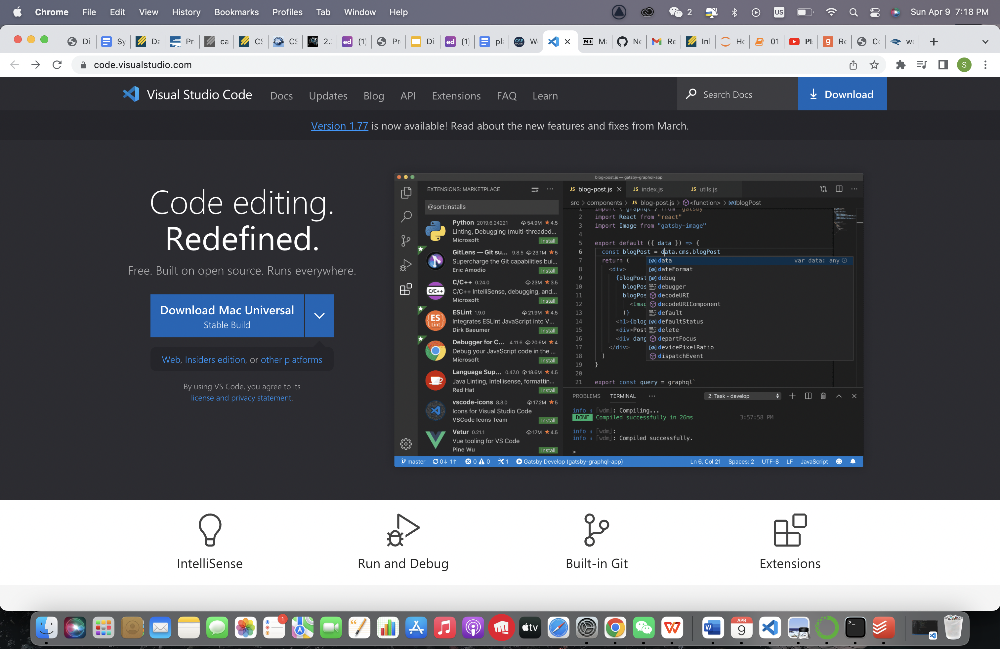
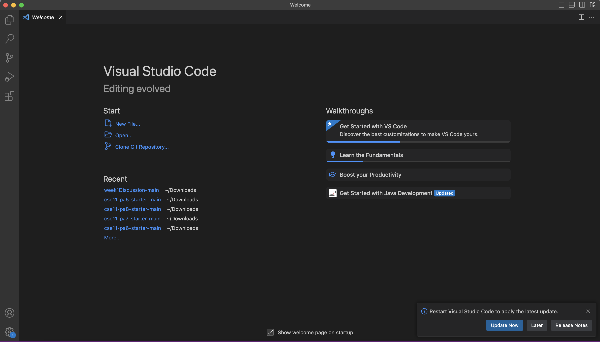
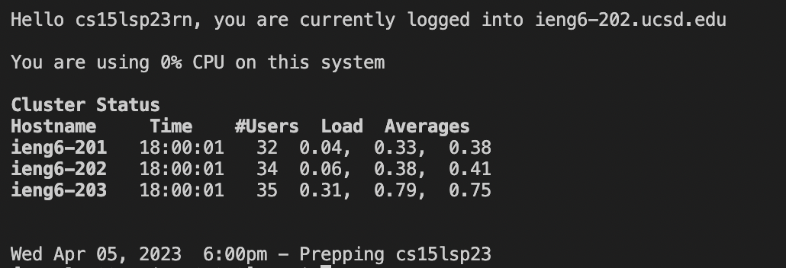
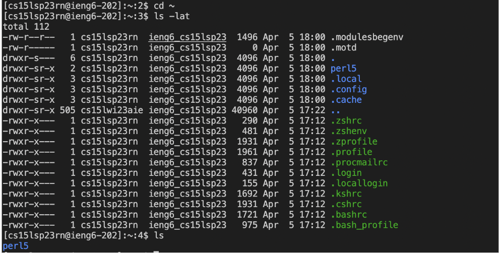

* First, set up the account by changing your 15L password at [Link](https://sdacs.ucsd.edu/~icc/index.php)
# Installing VScode
* Down load VScode from the websit at [Link](https://sdacs.ucsd.edu/~icc/index.php). (I already have VScode on my computer)

* Follow the instructions
* Open VSCode

# Remotely Connecting
* In the terminal of VSCode, type '$ ssh cs15lsp23zz@ieng6.ucsd.edu' where zz should be replaced by your own account ID.
* Type yes when it's asking: Are you sure you want to continue connecting (yes/no/[fingerprint])? Password: 
* And enter your password.
* You will see the logged in information like:

# Trying Some Commands
* Now you can run some command lines in the terminal

* Here are some commands to try: cd, ls, pwd, mkdir, and cp
