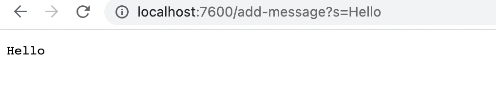
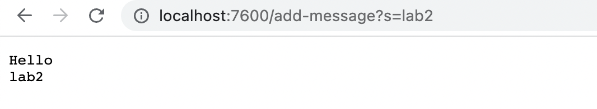

# Part1

Code of `String Server`
```
import java.io.IOException;
import java.net.URI;
import java.util.ArrayList;

class Handler3 implements URLHandler {
    ArrayList<String> str = new ArrayList<>(); 

    public String handleRequest(URI url) {
        
        if (url.getPath().equals("/add-message")) {
            String[] parameters = url.getQuery().split("=");
            if (parameters[0].equals("s")){

                str.add(parameters[1]);
                return String.join("\n",str) + "\n";
 
            }         
        }
        return "";
    }
}


class StringServer {
    public static void main(String[] args) throws IOException {
        if(args.length == 0){
            System.out.println("Missing port number! Try any number between 1024 to 49151");
            return;
        }

        int port = Integer.parseInt(args[0]);

        Server.start(port, new Handler3());
    }
}
```

When calling the main method, the handleRequest method is called to add string, server.start() is called to start the service.
`http://localhost:7600/add-message?s=Hello`
`url` is http://localhost:7600/add-message?s=Hello
`parameters[0]` is `s`
`parameter[1]` is `Hello`
`str` is `Hello`
`port` is `7600`
Everything just got updated beacuse it is the first time calling the method.

Same thing happended when when calling `http://localhost:7600/add-message?s=lab2`
`url` is http://localhost:7600/add-message?s=lab2
`parameters[0]` is `s`
`parameter[1]` is `lab2`
`str` is `Hello` and `lab2`
`port` is `7600`
For the second time, only the ArrayList `str` changed by adding another string to it.
# Part 2
Bug code
```
static int[] reversed(int[] arr) {
    int[] newArray = new int[arr.length];
    for(int i = 0; i < arr.length; i += 1) {
      arr[i] = newArray[arr.length - i - 1];
    }
    return arr;
  }
  ```
  Error code and JUnit
```
int[] input2 = {1,2,3,4,5};
    ArrayExamples.reversed(input2);
```
## A failure-inducing input for the buggy program
```
JUnit version 4.13.2
.E
Time: 0.004
There was 1 failure:
1) testReversed(ArrayTests)
arrays first differed at element [0]; expected:<5> but was:<0>
        at org.junit.internal.ComparisonCriteria.arrayEquals(ComparisonCriteria.java:78)
        at org.junit.internal.ComparisonCriteria.arrayEquals(ComparisonCriteria.java:28)
        at org.junit.Assert.internalArrayEquals(Assert.java:534)
        at org.junit.Assert.assertArrayEquals(Assert.java:418)
        at org.junit.Assert.assertArrayEquals(Assert.java:429)
        at ArrayTests.testReversed(ArrayTests.java:23)
        ... 30 trimmed
Caused by: java.lang.AssertionError: expected:<5> but was:<0>
        at org.junit.Assert.fail(Assert.java:89)
        at org.junit.Assert.failNotEquals(Assert.java:835)
        at org.junit.Assert.assertEquals(Assert.java:120)
        at org.junit.Assert.assertEquals(Assert.java:146)
        at org.junit.internal.ExactComparisonCriteria.assertElementsEqual(ExactComparisonCriteria.java:8)
        at org.junit.internal.ComparisonCriteria.arrayEquals(ComparisonCriteria.java:76)
        ... 36 more

FAILURES!!!
Tests run: 1,  Failures: 1
```

## An input that doesn’t induce a failure
```
int[] input1 = { };
    assertArrayEquals(new int[]{ }, ArrayExamples.reversed(input1));
    ```
   
```
(base) Solomons-Macbook:lab3 solomonhuang$ java -cp .:lib/hamcrest-core-1.3.jar:lib/junit-4.13.2.jar org.junit.runner.JUnitCore ArrayTests
JUnit version 4.13.2
.
Time: 0.004

OK (1 test)
```


Correct code
```
static int[] reversed(int[] arr) {
    int[] newArray = new int[arr.length];
    for(int i = 0; i < arr.length; i += 1) {
      newArray[i] = arr[arr.length - i - 1];
    }
    return newArray;
  }
  ```
  The new code fix the bug because the code reverse the old array and return it into a new array instead copying the wrong elements into the old array.
# Part 3
I don't have how to set up a local server before. After week 2, I can use the code given as well as my methods to perform simple incrementation on website.
