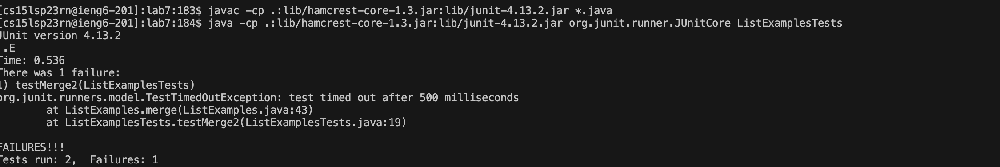

# Lab 4

## Step 4 --  Log into ieng6

key: ``ieng6 account`` ``<enter>`` ``password`` ``<enter>``

## Step 5 -- 

key pressed: ``git@github.com:SoloMidN/lab7.git`` ``<enter>``

cloned the respiratory in ieng6 by using the ssh keys just generated

## Step 6--

key pressed: ``javac -cp .:lib/hamcrest-core-1.3.jar:lib/junit-4.13.2.jar *.java`` 
``java -cp .:lib/hamcrest-core-1.3.jar:lib/junit-4.13.2.jar org.junit.runner.JUnitCore  ListExamplesTests``
Compile the tester and run it and ``ListExamplesTestsste``
Failure is shown

## Step 7--

key pressed: ``vim ListExamples.java`` ``<enter>`` ``43J`` ``e`` ``x`` ``i`` ``2`` ``<esc>`` ``:qw``

The above command entered the vim mode of ListExample
``43J`` goes to the line where the error is at.
``e`` goes to the end of first word, which is ``1`` 
``x`` delets the ``1`` because it is an error
``i`` entered the insert mode
``2`` add 2 after index, fixing the bug
``<esc>`` quit the insert mode
``:wq`` save and quit the vim mode

## Step 8--

key pressed: ``<up>`` ``<up>`` ``<up>`` ``<up>`` ``<up>`` ``<up>`` ``<up>`` ``<enter>`` 
The javac -cp .:lib/hamcrest-core-1.3.jar:lib/junit-4.13.2.jar *.java command was 7 up in the search history, so I used up arrow to access it.
``<up>`` ``<up>`` ``<up>`` ``<up>`` ``<up>`` ``<up>`` ``<enter>`` 
Then the java -cp .:lib/hamcrest-core-1.3.jar:lib/junit-4.13.2.jar org.junit.runner.JUnitCore ListExamplesTests command was 6 up in the history, so I accessed and ran it in the same way.

The test passed

## step 9--

commite and push using ``git add .`` ``git commit -m "message"`` and ``git push``

