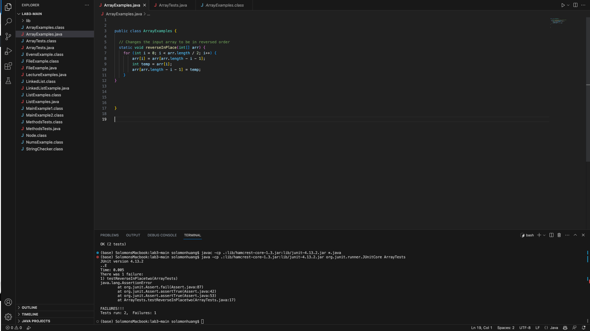
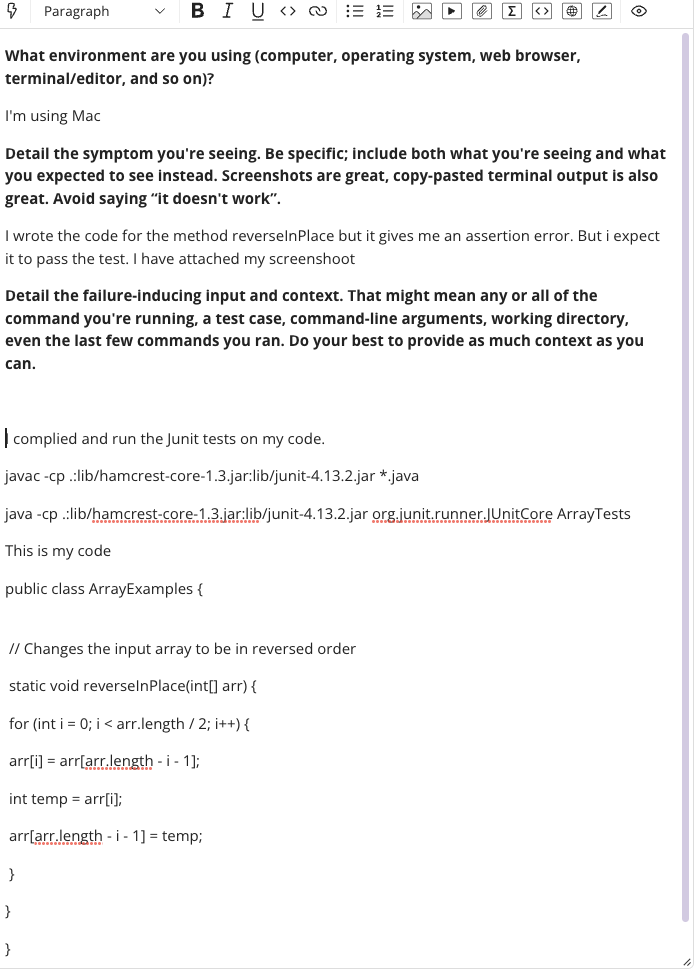
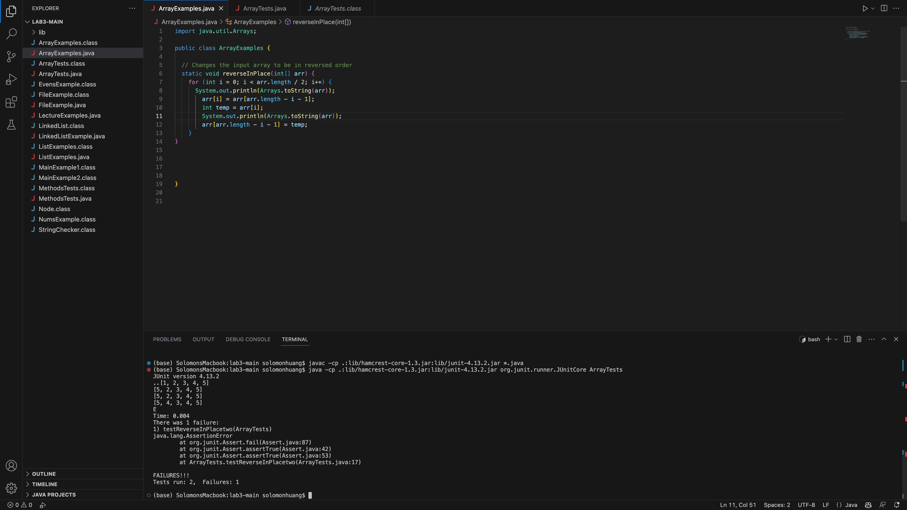

# Lab 5

## 1. screenshot 

The post 

## 2. TA asking questions
Hi,it seemslike there might be a bug in your implementation. I suggest you to print out the arrays before and after the swap operation.

You can use ``System.out.println(Arrays.toString(arr)); `` to print out the array.

Make sure to ``import java.util.Arrays;``.

## 3. Trying
Thank you for the suggestion. I have tried that.

I can see my array now. 

I realized that the last element has not been replaced with the original first element. In the next iteration, 
the second and third elements are not replaced at all, because ``arr[arr.length - i - 1]`` is assigned to itself.

The bug is it overwrites the ``arr[i]`` element before storing its original value in the ``temp``

## 4 Summary
The files

Directory: /Users/solomonhuang/Downloads/lab3-main/ArrayTests.java 

/Users/solomonhuang/Downloads/lab3-main/ArrayExamples.java

/Users/solomonhuang/Downloads/lab3-main/bash.sh

The bash will trigger the bug

To fix the bug, swap ``int temp = arr[i];`` and ``arr[i] = arr[arr.length - i - 1];``

# Part 2 – Reflection
I leanred how to write a simple bash script and run it and the code.
I also learned so vim command so that i can manipulate the code in terminal.

I found the debugging experience is really fun and useful which taught me how to look at 
the error message
